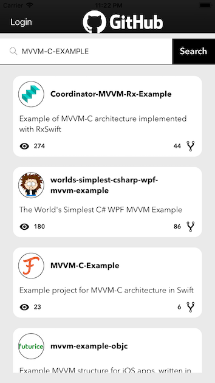
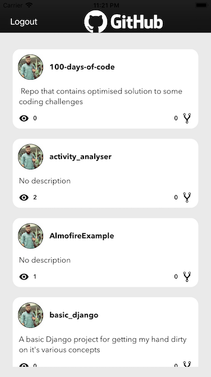
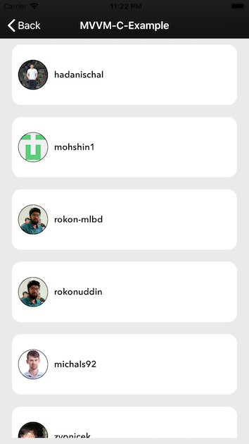

# RepositoryFinder
Example project for the implementation of VIPER-B in iOS Swift. It's an application that uses github apis to get repos details. You can also login to your Github account and check you repos.
## How to run project
This project was developed on **Xcode 9.4** using **Swift 4.1** . Please run **pod install** after cloning the repo and checking out to master for running the project.

## Project Overview
It's an application that let user query public github repositories. It also allow user to login and see thier public repositories at github too. User can also view the forks by tapping the repository. Every Single request is **paginated** and show **30** repositories in a single call after which user must have to tap **show more** cell for viewwing further repositories. It's build on the **VIPER** architecture and and every module's interactor and presenter are unit tested.

## Pods used
- Alamofire
- SDWebImageView
- NVActivityIndicatorView

## Screen Shots

## Lgoin View

## Search Repository View

## User Repository View

## Forks List View

In case of any query feel free to contact @ osama.binbashir@yahoo.com

